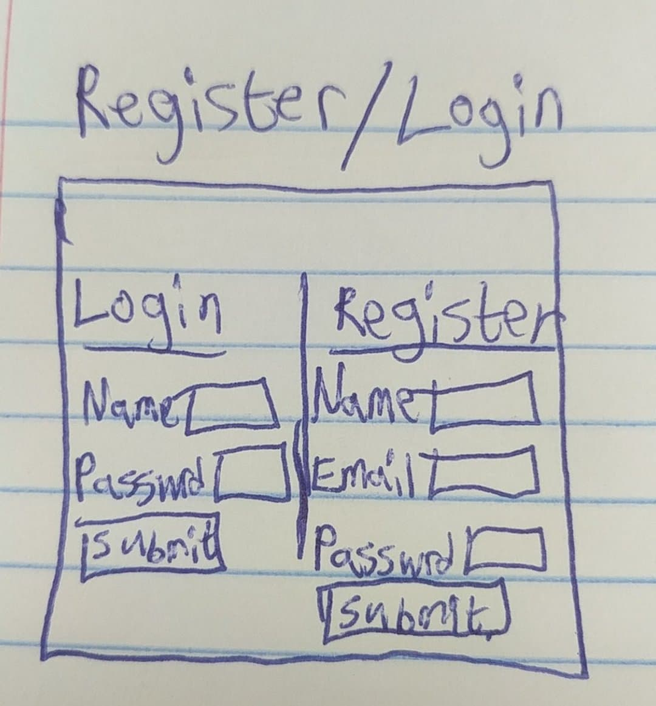
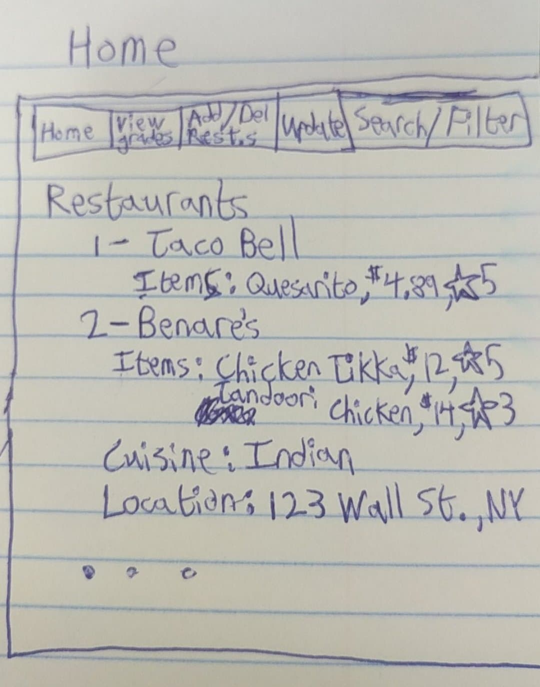
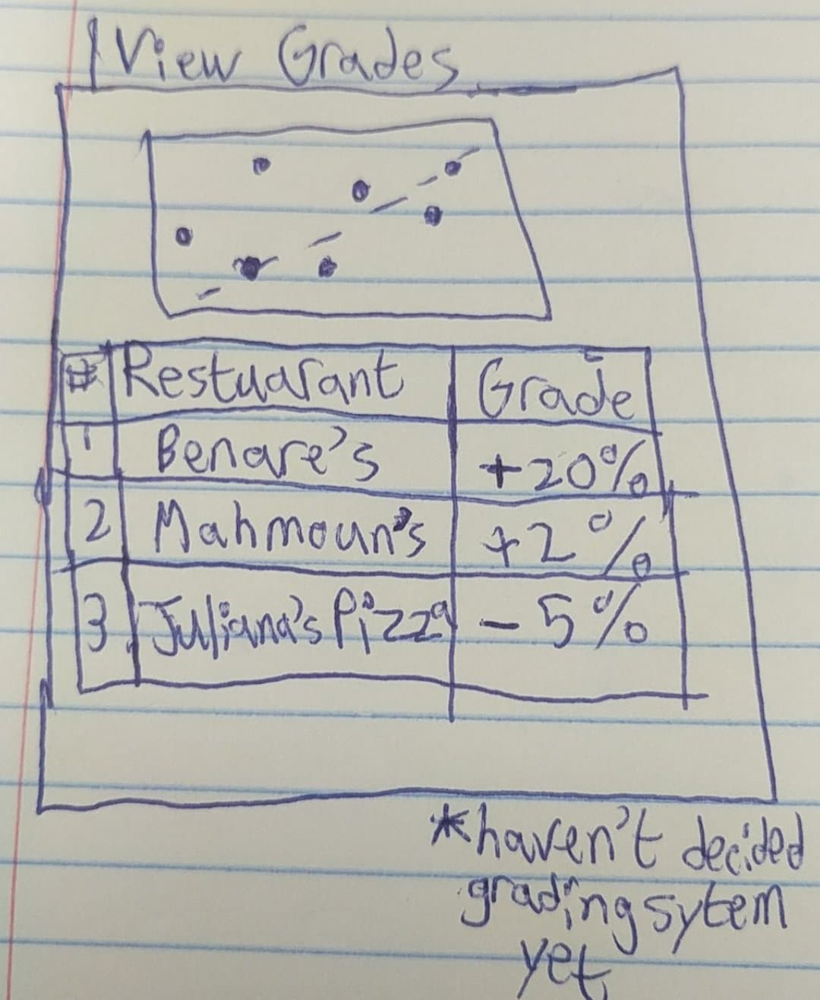
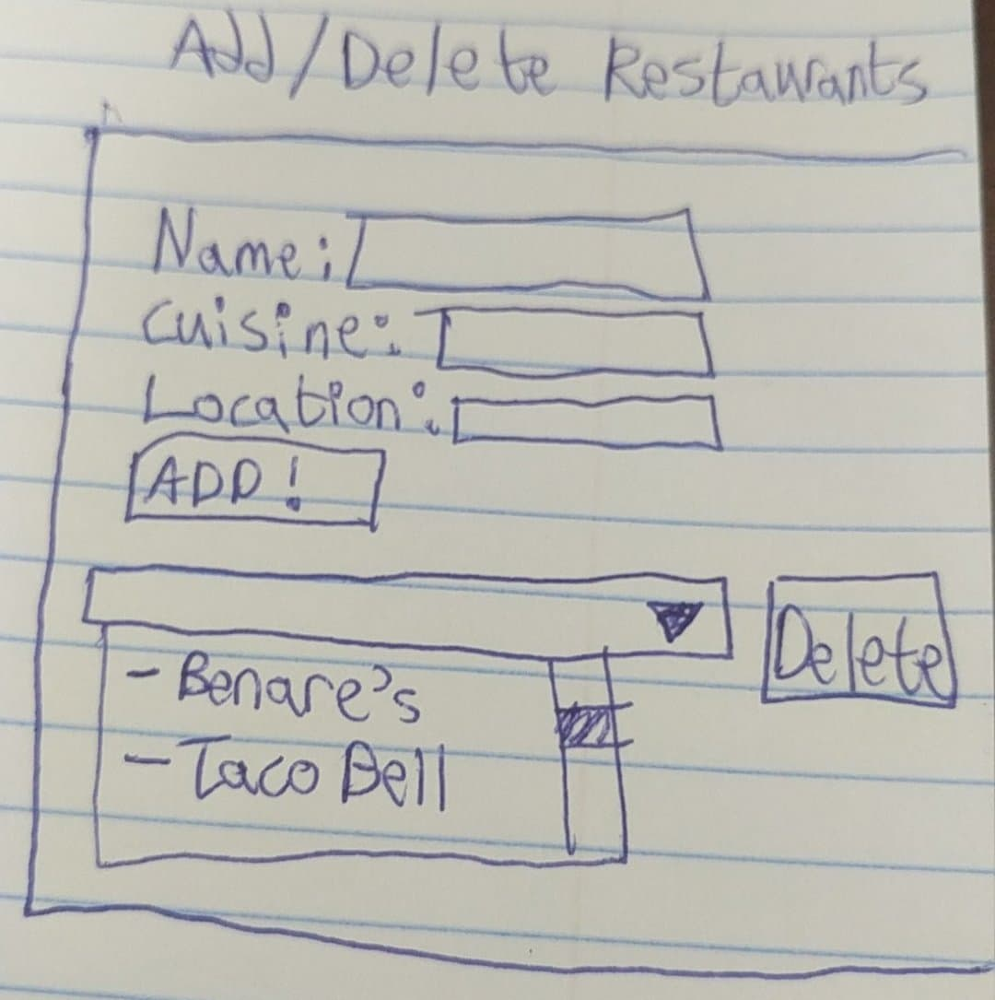
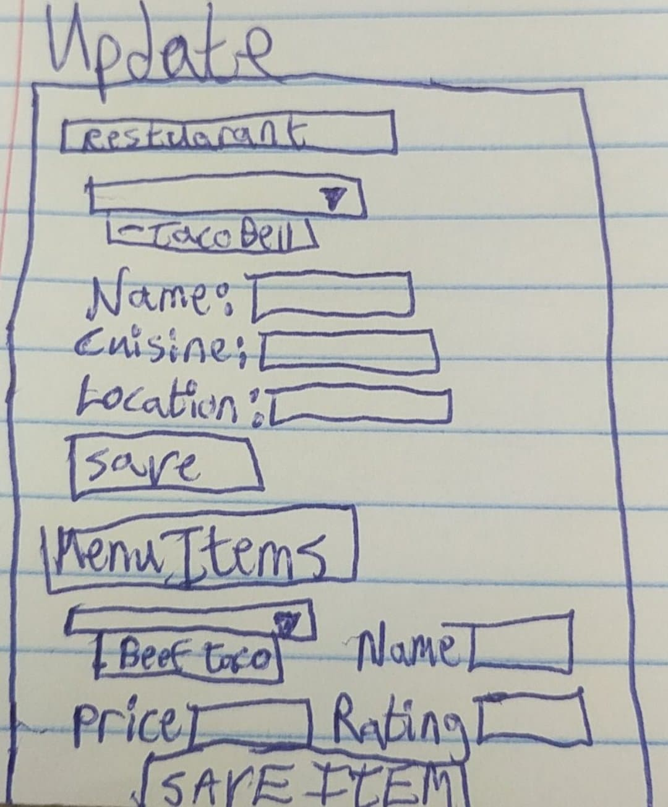
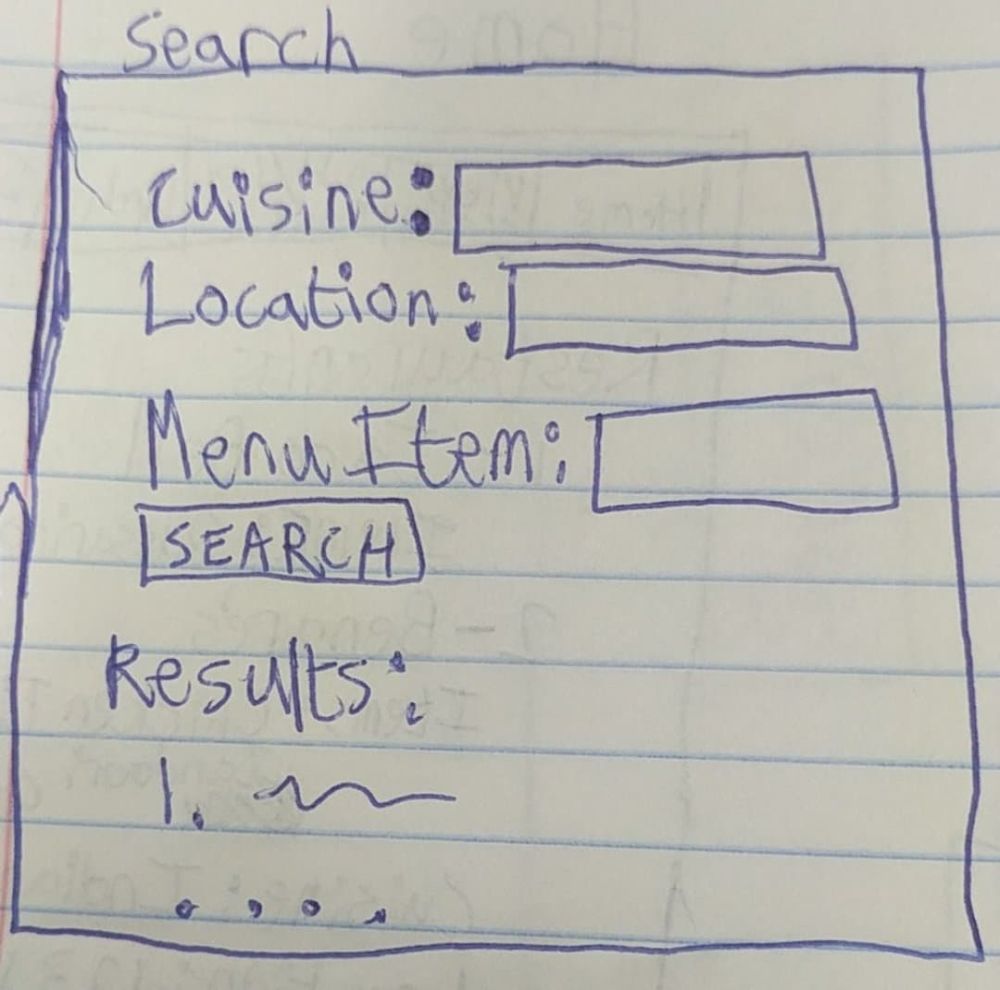
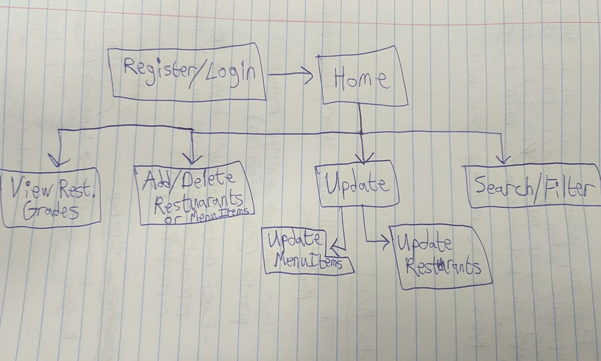

# AbirHassan-final-project

# Bytes

## Overview

Figuring out where to eat can be annoying sometimes. Especially when you want to get te best bang for your buck. Bytes is here to help you make the best decision on where to grab a bite to eat.

Bytes is a web app that will allow users who are registered & logged in to keep track of any restaurants that they like, along with their favorite dishes at those restaurants. Over time, users will have built up a journal of restaurants, those restaurants' menus, and the prices. They can use Bytes to help sort restaurants by cuisine, get Yelp and location information, and use Bytes linear regression feature to calculate how well the value is on each restuarant's food.

## Data Model

The application will store Users, Restuarants, and MenuItems

* users can have multiple restuarants in their profile (via references)
* each restuarant will have a list of MenuItems that represent food items on that restuarant's menu along with each item's corresponding price
  * MenuItems are embedded into Restuarants

An Example User:

```javascript
{
  username: "Anton Ego",
  password: // a password hash,
  lists: // an array of references to Restaurant documents
}
```

An Example Restuarant w/ Embedded MenuItems:

```javascript
{
  user: // a reference to a User object
  name: "Friendly Toast",
  location: "111 Broadway, New York, NY 11002"// address,
  items: [
    { name: "pancakes", price: "$12.75", rating: "3"},
    { name: "tacos", price: "$9.50", rating: "5"},
  ],
  yelp_info: {
    url: "https://www.yelp.com/",
    rating: 10,
    price: 8.99,
    phone: (212)443-9999,
    coordinates: {
      latitude: 40.6942,
      longitude: -73.9866
    }
  }
}
```

## [Link to Commented First Draft Schema](db.js) 

## Wireframes

/login - page for Registering or Logging In



/home - page for showing all restuarants



/list/viewgrades - page for showing specific shopping list



/list/addremove - page for adding or deleting restuarants



/list/update - page for updating restuarant info, or MenuItem info for selected restuarant



/list/search - page for searching/filtering restuarants



## Site map



## User Stories or Use Cases

1. as non-registered user, I can register a new account with the site
2. as a user, I can log in to the site
3. as a user, I can add a new restuarant to my profile or delete an existing one
4. as a user, I can view all of the restuarants in my profile along with their Menu Items that I've added
5. as a user, I can add or delete items to the menu of a single restuarant in my restuarant list
6. as a user, I can calculate the value grade for every restuarant in my profile. (Using linear regression, calculate the predicted average cost at a restuarant and see how well its actual cost matches up)
7. as a user, I can view the Yelp pages and locations of all restuarants in my profile

## Research Topics

* (4 - 6 points) Integrate Linear Regression for Restuarant grading
    * I'm going to use a restuarant's average price and average rating to perform linear regression
    * Basically, I want to see how much greater than or less than a restuarant's actual average price is when compared to its predicted average price
    * Use regression module to compute linear regression line for predicted prices of restuarant's (i.e. how much you should be spending there)
    * Use Google Charts to display the regression line along with the (rating, price) pairs of the restuarants
    * Create grading system based on residuals from regression line (how much you should be spending versus how much you are actually spending)
      * A restuarant has good value on its food if the actual cost is lower than the estimated cost
      * Estimated Cost - Actual Cost is the residual; A higher value means a higher grade
* (2 points) Google Maps API
    * used Google Maps API to display the locations of all the restuarants users have added, along with the restuarants' addresses and phone numbers when the markers are clicked
* (2 points) Yelp Fusion API
    * used Yelp Fusion API to get more data on restuarants users have added and populate the data shown in the application. Also automatically links to the Yelp page of added restuarants

8 - 10 points total out of 8 required points

## [Link to Initial Main Project File](app.js) 

## Annotations / References Used
1. https://developers.google.com/maps/documentation/javascript/adding-a-google-map
2. https://www.yelp.com/developers/documentation/v3/business_search
3. https://developers.google.com/chart/interactive/docs/gallery/combochart
4. https://github.com/Tom-Alexander/regression-js